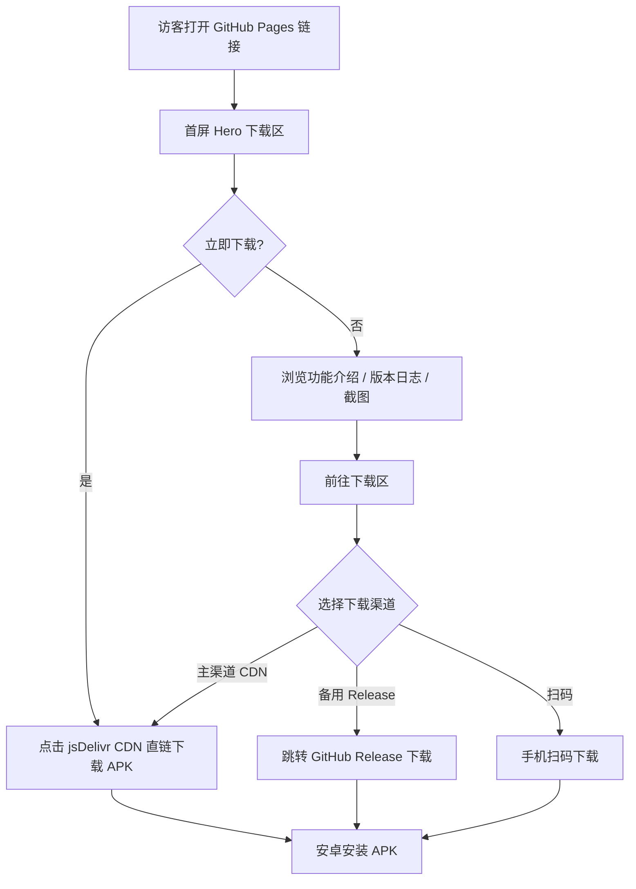

# HotVideo APP 下载站 — 产品需求文档（PRD）

## 1. 产品概述

HotVideo 下载站是一个基于 GitHub Pages 的纯静态单页下载官网，用于对外分发作者用 AIDE 自主开发的安卓热点视频 APP（HotVideo）。
- 目标：为零成本、无备案的安卓 APP 分发提供一个美观、稳定、国内可加速访问的落地页。
- 目标用户：安卓手机用户，扫码或点击链接即可下载安装包。
- 价值：替代付费服务器/备案域名，用 GitHub 免费托管 + jsDelivr CDN 加速实现自建分发渠道。

## 2. 核心功能

### 2.1 用户角色
| 角色 | 访问方式 | 核心权限 |
|------|---------------------|------------------|
| 普通访客 | 浏览器直链 / 二维码 | 浏览介绍、查看版本日志、下载 APK、查看隐私说明 |
| 作者（本人） | GitHub 仓库后台 | 上传新版本 APK、更新 index.html、发布 Release |

### 2.2 功能模块
单页落地页（index.html），包含以下模块：
1. **顶部导航**：Logo、锚点跳转（功能介绍 / 版本日志 / 截图 / 下载 / 隐私说明）。
2. **Hero 下载区**：APP 名称、一句话标语、主下载按钮（jsDelivr CDN 直链）、版本号与更新时间、备用下载入口（GitHub Release）。
3. **功能介绍**：仿抖音视频流、AI 聊天室、全网热榜等核心卖点卡片。
4. **版本日志**：V1~V8 迭代更新记录，与开发文档对应。
5. **截图展示**：APP 界面截图墙（assets 目录引用）。
6. **下载区**：主下载按钮 + 备用渠道 + 扫码下载（二维码）。
7. **隐私说明**：数据收集、存储规则、合规声明。
8. **页脚**：版权、GitHub 仓库链接、免责声明。

### 2.3 页面详情
| 页面名称 | 模块名称 | 功能描述 |
|-----------|-------------|---------------------|
| 下载落地页 | Hero 下载区 | 标语 + 主下载按钮（CDN 加速）+ 版本号 + 更新时间 + 备用下载 |
| 下载落地页 | 功能介绍 | 3~4 张卡片展示核心功能卖点 |
| 下载落地页 | 版本日志 | V1~V8 时间线式更新记录 |
| 下载落地页 | 截图展示 | 响应式截图墙，点击可放大 |
| 下载落地页 | 隐私说明 | 数据收集与合规声明 |
| 下载落地页 | 页脚 | 版权 / 仓库链接 / 免责声明 |

## 3. 核心流程

用户打开下载站后，首屏即看到下载按钮，可直接点击下载 APK；也可向下滚动查看功能介绍、版本日志、截图，最终在下载区或扫码完成下载。

## 4. 用户界面设计

### 4.1 设计风格
- 主题：深色科技风，呼应"热点视频"的"热"——以深黑/深灰为底，主色用炽热橙红渐变（#ff4d4f → #ff8a3d），象征"热点"。
- 按钮：主下载按钮为橙红渐变 + 圆角 + 悬浮发光阴影；次按钮为玻璃拟态描边。
- 字体：标题用富有张力的无衬线展示字体（中文用系统黑体回退），正文清晰易读。
- 布局：移动优先单列，桌面端居中容器（最大宽度 960px），卡片式分块。
- 动效：首屏渐入 + 滚动揭示 + 按钮悬浮发光，纯 CSS 实现以保证零依赖。
- 图标：使用内联 SVG，避免外部图标库依赖。

### 4.2 页面设计概览
| 页面名称 | 模块名称 | UI 元素 |
|-----------|-------------|-------------|
| 下载落地页 | Hero 下载区 | 深色背景 + 橙红渐变标题 + 大号下载按钮 + 版本标签 |
| 下载落地页 | 功能介绍 | 玻璃拟态卡片网格 + SVG 图标 |
| 下载落地页 | 版本日志 | 左侧时间线 + 版本号徽章 |
| 下载落地页 | 截图展示 | 响应式图片网格 + 悬浮放大 |
| 下载落地页 | 隐私说明 | 提示框样式 + 清单 |
| 下载落地页 | 页脚 | 简洁分栏 + 链接 |

### 4.3 响应式
- 移动优先：手机端单列堆叠，下载按钮全宽便于触控。
- 桌面端：卡片多列、容器居中，最大宽度 960px。
- 触控优化：按钮最小 48px 高度，间距充足。

### 4.4 3D 场景
不适用（纯静态 2D 落地页）。
