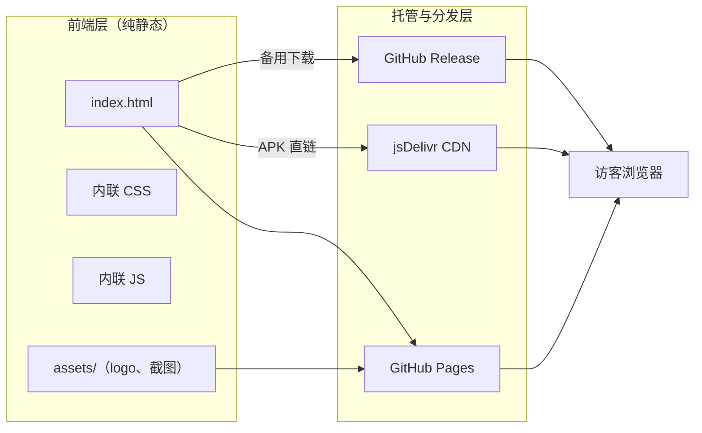

# HotVideo APP 下载站 — 技术架构文档

## 1. 架构设计

纯静态前端，无后端、无数据库、无构建工具。文件托管于 GitHub Pages，APK 直链经 jsDelivr CDN 加速，大文件/备用渠道走 GitHub Release。



## 2. 技术说明
- 前端：纯 HTML5 + CSS3（内联于 index.html）+ 原生 JS（内联）。**不使用框架/构建工具**，原因：
  - 用户明确选择 GitHub Pages 纯静态方案，需零构建、零依赖、可直接 push 生效。
  - 单页下载站无需 React 等框架的复杂度。
- 字体：系统字体栈（中文优先苹方/微软雅黑/黑体），保证国内加载速度，无外部字体请求。
- 图标：内联 SVG，零外部依赖。
- 二维码：内联一个轻量二维码生成脚本或预生成 SVG（指向 Pages 域名）。
- 初始化工具：无（手写静态文件）。
- 后端：无。
- 数据库：无。

## 3. 路由定义
| 路由 | 用途 |
|-------|---------|
| `/` (index.html) | 下载落地页，承载全部模块 |
| `/HotVideo.apk` | APK 安装包（仓库根目录，Pages 直链） |
| `/assets/*` | logo、截图等静态资源 |

外部加速/备用链接（非本站路由，在页面中引用）：
- jsDelivr CDN：`https://cdn.jsdelivr.net/gh/用户名/用户名.github.io@main/HotVideo.apk`
- GitHub Release：`https://github.com/用户名/用户名.github.io/releases`

## 4. API 定义
不适用（纯静态站，无后端 API）。

## 5. 服务端架构
不适用（无服务端，GitHub Pages 提供静态托管）。

## 6. 数据模型
不适用（无数据库）。页面内容（版本日志、功能介绍）为静态硬编码于 index.html 中，更新时直接编辑该文件。

## 7. 文件结构
```
仓库根目录
├─ index.html        // 下载落地页（内联 CSS/JS）
├─ HotVideo.apk      // 安装包（需作者自行上传）
└─ assets/
   ├─ logo.png        // APP 图标
   ├─ icon.svg        // 页面 favicon / logo
   └─ screenshots/    // 界面截图（需作者自行上传）
```

## 8. 部署步骤
1. 创建仓库 `用户名.github.io`（Public）。
2. 将 `index.html` 与 `assets/` 推送到 `main` 分支根目录。
3. 上传 `HotVideo.apk` 到根目录（<100MB；超出则改用 Release）。
4. Settings → Pages → Source: Deploy from a branch → Branch: `main` / `(root)`。
5. 访问 `https://用户名.github.io` 验证。
6. 将 `index.html` 内下载按钮的 CDN 链接中的 `用户名` 替换为实际 GitHub 用户名即可启用 jsDelivr 加速。

## 9. 关键约束与合规
- APK 需正式签名打包，降低安卓"危险文件"提示。
- 页面须标注隐私说明与数据收集规则。
- 仅分发自主开发的 HotVideo，禁止侵权/违规内容，避免仓库被封。
